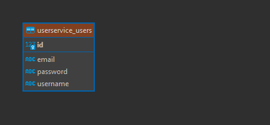

<h1 align="center"> 
  Spring-boot-microservice API  
  
   
  
  
  
   <br>
  
  
  
  
  <br>
</h1>

<p align="center">
  <a href="#ℹ%EF%B8%8F-introduction">Introduction</a> •
  <a href="#installation-guide">Installation Guide</a> •
  <a href="#api">API Reference</a> •
  <a href="#database-entityrelationship">Database ER</a> •
  <a href="#license">License</a> •
  <a href="#contributors">Contributors</a> 
</p>

<div align="center">


</div>

## ℹ️ Introduction
- This is a CRUD API project in [microservice architecture](https://www.atlassian.com/microservices/microservices-architecture), using Spring Boot, Hibernate and PostgreSQL. 
- Project started with [spring initializr](https://start.spring.io/).
- The project:
    - uses Maven as a build tool.
    - uses PostgreSQL as a database. 
    - uses Hibernate as an ORM tool.
    - uses Spring Security, [Keycloak](https://www.keycloak.org/) and JWT Bearer for authentication.

- Project's diagram:
 

> [!TIP]    
> For client side, please refer to following project: [Spring Boot Microservice React](https://github.com/Ctere1/spring-boot-microservice-react) 

## 💾Installation Guide

- To clone and run this application, you'll need [Git](https://git-scm.com), [Java](https://www.java.com/en/download/help/download_options.html), [Docker](https://www.docker.com/get-started/) and [PostgreSQL](https://www.postgresql.org/download/) (optional) installed on your computer.
From your command line:

    ```bash
    # Clone this repository
    $ git clone https://github.com/Ctere1/spring-boot-microservice
    # Go into the repository
    $ cd spring-boot-microservice
    # Install the dependencies
    $ bash service_install.bash
    # Run the app with docker
    $ docker-compose up
    ```
   
> [!TIP]  
> If you want to make changes for each service-server, you need to run `mvn clean install` for each one. You can use the bash script instead. (`bash service_install.bash`)

> [!IMPORTANT]  
> Before starting, make sure that the ports do not conflict in your local machine. For detailed information, see the `docker_compose.yaml` file.

> [!NOTE]      
> You can add `127.0.0.1 keycloak` to the host file in your local machine for debugging "http://keycloak:8080" endpoint. (C:\Windows\System32\drivers\etc)        
> Note that it is not mandatory to add. If you do not the server will work **without** errors, there is no need to be afraid.


- After these steps, you can use the API with [Postman](https://www.postman.com/) or any other API testing tool:
    - Signup and create user,
    - Login and get access,
    - Test the server.


## ⚡API

- You can check the swagger documentation after running the server. The swagger documentations are available at:
    - **Product**:  `http://localhost:5861/swagger-ui/index.html#/`
    - **Cart**:     `http://localhost:5863/swagger-ui/index.html#/`
    - **User**:     `http://localhost:5865/swagger-ui/index.html#/`

- You can perform CRUD operations with authentication in the swagger ui.  
   
     
     


### **User Endpoints**

- You need to get access before testing the API, first step do post request to `signup` enpoint. Below is a sample response of the user endpoint.   


| HTTP Verb   | Endpoint                    | Description                         | Parameters      | Body (JSON)                             |
| :---------- | :-----------------------    |:----------------------------------  | :-------------  | :-------------------------------------  | 
| `POST`      | `/api/user/signup`          |  Creates new user for login         | -               | `username`, `email`, `password`         |
| `POST`      | `/api/user/signin`          |  Returns the user and accessToken   | -               | `username`, `password`                  |


### **User Endpoint Data Example**

>     
> http://localhost:5860/api/user/signin | JSON Body: {"username": "cemil","password": "123456"}

```json
{
  "id": 2,
  "username": "cemil",
  "email": "test@email.com",
  "tokenType": "Bearer",
  "accessToken": "*********************"
}
```

> [!TIP]  
> See postman collection for details       


## 💽Database Entity–relationship

| Product Table        | Cart Table         | User Table         |            
| :----------------:   | :----------------: | :----------------: |
|   |  |  | 
          

## ©License


## 📌Contributors

<a href="https://github.com/Ctere1/">
  
</a>
